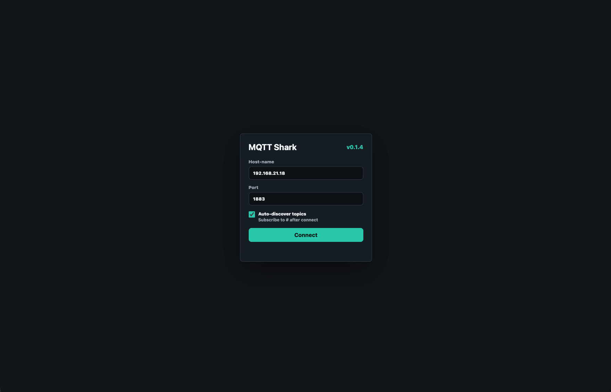
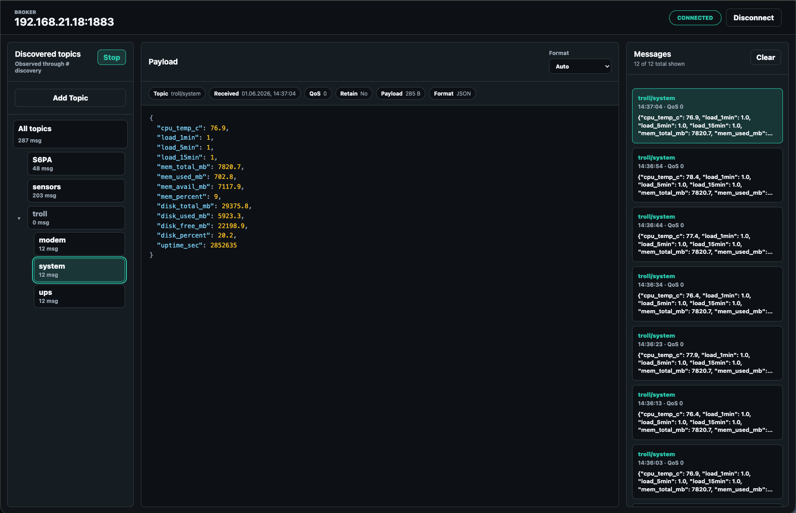

# MQTT Shark

[](LICENSE)
[](https://github.com/KernelMrex/mqtt-shark/pkgs/container/mqtt-shark)

MQTT Shark is a lightweight web MQTT explorer for debugging broker traffic from your browser. It helps you connect to a broker, discover live topics, inspect incoming messages, and understand payloads without installing a desktop client.

It ships as a single Docker image with a Go backend, a React frontend, and an embedded production build, so the same artifact can run locally, in a lab, or next to your MQTT infrastructure.

## Screenshots

| Topic explorer | Payload inspection |
| --- | --- |
|  |  |

## Why MQTT Shark

- Fast broker inspection when you need to see what is actually moving through MQTT.
- Topic discovery through `#`, shown as a navigable topic tree instead of a flat stream.
- Message history with QoS, retain flag, timestamps, topic filters, and selected-message pinning.
- Payload viewer with auto detection and explicit `Text`, `JSON`, `XML`, `Binary`, and `Base64` modes.
- Simple deployment: one HTTP service, one Docker image, no separate frontend hosting.

## Quick Start

Run the published image:

```bash
docker run --rm -p 8080:8080 ghcr.io/kernelmrex/mqtt-shark:latest
```

Open http://localhost:8080 and connect to your broker.

Optionally prefill the broker host field from the runtime environment:

```bash
docker run --rm -p 8080:8080 \
  -e MQTT_SHARK_BROKER_HOST=192.168.1.10 \
  ghcr.io/kernelmrex/mqtt-shark:latest
```

Or build and run the local Docker image:

```bash
make up
```

Stop the container with:

```bash
make down
```

## Local Development

Run the full app locally:

```bash
make run
```

For frontend-only development, keep the Go backend running with `make run`, then start Vite:

```bash
make frontend-dev
```

The app is served from http://localhost:8080. The Vite dev server proxies API traffic to the Go backend.

## Build and Test

Build the local binary:

```bash
make build
```

Run checks:

```bash
make check
```

The frontend is built first, then embedded into the Go binary. The app version is exposed in the web UI through `/api/info`; tagged builds use the exact Git tag on `HEAD`, while untagged builds use the short commit hash.

## Architecture

- Backend: Go `net/http`, embedded static files, and a WebSocket bridge.
- MQTT client: Eclipse Paho MQTT.
- Frontend: React and Vite.
- Packaging: Docker Buildx multi-architecture images for `linux/amd64` and `linux/arm64`.

## Compatibility Note

Versions before `v1.0.0` do not guarantee backward compatibility between the frontend and backend.

## Roadmap

See [ROADMAP.md](ROADMAP.md) for planned work. The near-term direction is practical MQTT exploration: smoother publishing, saved broker profiles, stronger tests around session behavior, and safer exposed deployments.

## Security Note

MQTT Shark is designed as an operator/debugging tool. Do not expose it publicly without authentication, TLS, and network restrictions.

## License

MQTT Shark is released under the [MIT License](LICENSE).
